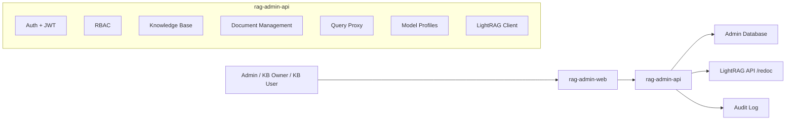

# OpenLinkHub RAG Admin Design

## 1. Product Goal

OpenLinkHub RAG Admin is a knowledge base management system built around LightRAG.
LightRAG remains the retrieval and generation engine. This project provides the
management layer around it: users, roles, permissions, knowledge base authorization,
document operations, query testing, model profile management, and operational audit.

The system should serve three groups:

- Platform administrators who manage users, roles, models, and LightRAG endpoints.
- Knowledge base owners who manage one or more knowledge bases and authorize members.
- Knowledge base users who upload documents, observe indexing status, and test queries.

## 2. Design Principles

- Do not modify LightRAG core for business management concerns.
- Treat LightRAG as an external RAG engine accessed through a narrow adapter.
- Put RBAC, authorization, auditing, model profiles, and knowledge base ownership in
  the OpenLinkHub management service.
- Prefer real data isolation by binding each knowledge base to a LightRAG endpoint or
  workspace. Avoid pretending a single LightRAG instance is multiple isolated
  knowledge bases unless LightRAG itself provides the isolation.
- Keep the first release focused on a complete management loop instead of advanced
  orchestration.

## 3. Repository Layout

```text
OpenLinkHub-RAG/
  LightRAG/                         # Upstream LightRAG project
  services/
    rag-admin-api/                  # Spring Boot management backend
  apps/
    rag-admin-web/                  # Vue management frontend
  docs/
    rag-admin-design.md             # This design document
```

## 4. System Architecture



The frontend only talks to `rag-admin-api`. The backend checks user permissions,
loads the target knowledge base endpoint, proxies allowed requests to LightRAG, and
records audit logs for sensitive operations.

## 5. LightRAG Integration Boundary

The management service integrates with LightRAG through these API groups:

- Documents:
  - `POST /documents/upload`
  - `POST /documents/text`
  - `POST /documents/texts`
  - `POST /documents/paginated`
  - `GET /documents/pipeline_status`
  - `GET /documents/status_counts`
  - `DELETE /documents/delete_document`
  - `POST /documents/reprocess_failed`
  - `POST /documents/cancel_pipeline`
- Query:
  - `POST /query`
  - `POST /query/stream`
  - `POST /query/data`
- Graph:
  - `GET /graphs`
  - `GET /graph/label/list`
  - `GET /graph/label/popular`
  - `GET /graph/label/search`
  - entity and relation edit APIs
- System:
  - `GET /health`
  - `GET /auth-status`
  - `POST /login`

The first implementation should wrap documents, query, health, and pipeline status.
Graph edit operations should be postponed until the authorization and audit model is
stable.

## 6. Knowledge Base Model

LightRAG is treated as a per-engine knowledge base runtime. OpenLinkHub adds the
business knowledge base concept:

```text
KnowledgeBase
  id
  name
  code
  description
  endpointId
  ownerUserId
  status
  defaultQueryMode
  createdAt
  updatedAt

LightRagEndpoint
  id
  name
  baseUrl
  apiKeyEncrypted
  authType
  healthStatus
  lastCheckedAt
```

For MVP, users register existing LightRAG endpoints. Later, the system can create and
manage LightRAG instances through Docker Compose, Supervisor, or Kubernetes.

## 7. RBAC Model

Core entities:

```text
User
Role
Permission
UserRole
RolePermission
KnowledgeBaseMember
```

Built-in roles:

- `SUPER_ADMIN`: full platform permissions.
- `RAG_ADMIN`: manage knowledge bases, endpoints, documents, and model profiles.
- `KB_OWNER`: manage one knowledge base and its members.
- `KB_EDITOR`: upload, delete, and reprocess documents for authorized knowledge bases.
- `KB_VIEWER`: query and view document status for authorized knowledge bases.
- `AUDITOR`: view audit logs.

Permission examples:

```text
user:manage
role:manage
permission:view
kb:create
kb:update
kb:delete
kb:authorize
endpoint:manage
doc:upload
doc:delete
doc:reprocess
query:execute
model:manage
audit:view
```

Authorization is two-layered:

1. Global RBAC checks whether a user can perform a class of operation.
2. Knowledge base membership checks whether a user can perform it on the target KB.

## 8. Model Profile Management

LightRAG model settings are primarily startup/environment configuration. Therefore
MVP model switching should be configuration governance rather than unsafe live edits.

```text
ModelProvider
  id
  name
  type
  baseUrl
  apiKeyEncrypted

ModelProfile
  id
  name
  providerId
  llmBinding
  llmModel
  embeddingBinding
  embeddingModel
  embeddingDim
  rerankBinding
  rerankModel
  configJson
  status

ModelSwitchRecord
  id
  knowledgeBaseId
  fromProfileId
  toProfileId
  status
  appliedBy
  appliedAt
```

MVP behavior:

- Store model profiles.
- Assign a profile to a knowledge base.
- Mark endpoint as `pending_restart` after switching.
- Display a clear restart requirement.

Future behavior:

- Generate LightRAG environment config.
- Trigger managed restart.
- Support versioned rollback.

## 9. Frontend Information Architecture

Pages:

- Login
- Dashboard
- Knowledge Bases
  - Overview
  - Documents
  - Query Playground
  - Members
  - Model Profile
  - Engine Health
- Users
- Roles
- Model Profiles
- Endpoints
- Audit Logs
- System Settings

UX style:

- Dense management console, not a marketing page.
- Tables, filters, tabs, status tags, operation drawers, and confirmation dialogs.
- Query playground should use a chat-like streaming panel.
- References should be collapsible.
- Dangerous operations such as clear/delete/cancel pipeline require confirmation.

## 10. Backend API Surface

Admin APIs should use `/api/admin/**`.

Suggested groups:

```text
POST   /api/admin/auth/login
GET    /api/admin/auth/me

GET    /api/admin/users
POST   /api/admin/users
PUT    /api/admin/users/{id}
DELETE /api/admin/users/{id}

GET    /api/admin/roles
POST   /api/admin/roles
PUT    /api/admin/roles/{id}

GET    /api/admin/knowledge-bases
POST   /api/admin/knowledge-bases
GET    /api/admin/knowledge-bases/{id}
PUT    /api/admin/knowledge-bases/{id}
POST   /api/admin/knowledge-bases/{id}/members

GET    /api/admin/knowledge-bases/{id}/documents
POST   /api/admin/knowledge-bases/{id}/documents/upload
POST   /api/admin/knowledge-bases/{id}/documents/text
DELETE /api/admin/knowledge-bases/{id}/documents/{docId}
GET    /api/admin/knowledge-bases/{id}/pipeline-status

POST   /api/admin/knowledge-bases/{id}/query
POST   /api/admin/knowledge-bases/{id}/query/stream

GET    /api/admin/model-profiles
POST   /api/admin/model-profiles
POST   /api/admin/knowledge-bases/{id}/model-profile

GET    /api/admin/audit-logs
```

## 11. First Release Scope

The first release should include:

1. Spring Boot backend skeleton.
2. Vue admin frontend skeleton.
3. Login and static seed administrator.
4. RBAC domain model and permission constants.
5. Knowledge base CRUD.
6. LightRAG endpoint registration and health check.
7. Document list, upload, text insert, delete, and pipeline status proxy.
8. Query playground with streaming response proxy.
9. Model profile CRUD and assignment with `pending_restart` status.
10. Audit log records for login, KB changes, document operations, model switching, and query execution.

Postpone:

- Full graph editing.
- Managed LightRAG instance creation.
- Automatic restart.
- Advanced usage billing/statistics.
- RAG quality evaluation.

## 12. Testing Strategy

Backend:

- Unit tests for RBAC checks.
- Unit tests for LightRAG client request mapping.
- Controller tests for authorization.
- Integration tests with mocked LightRAG endpoints.

Frontend:

- Build verification.
- Manual browser QA for dashboard, document upload, query stream, and permission states.

## 13. Roadmap

Phase 1: Management MVP

- RBAC, knowledge base registration, document management, query playground, model profiles.

Phase 2: Operational Control

- Endpoint health monitor, pipeline timeline, model profile versioning, restart workflow.

Phase 3: Graph And Quality

- Graph visualization, entity/relation editing, query evaluation datasets, quality reports.

Phase 4: Multi-Engine Platform

- Managed LightRAG instance lifecycle, engine templates, workspace isolation, quota and usage analytics.
